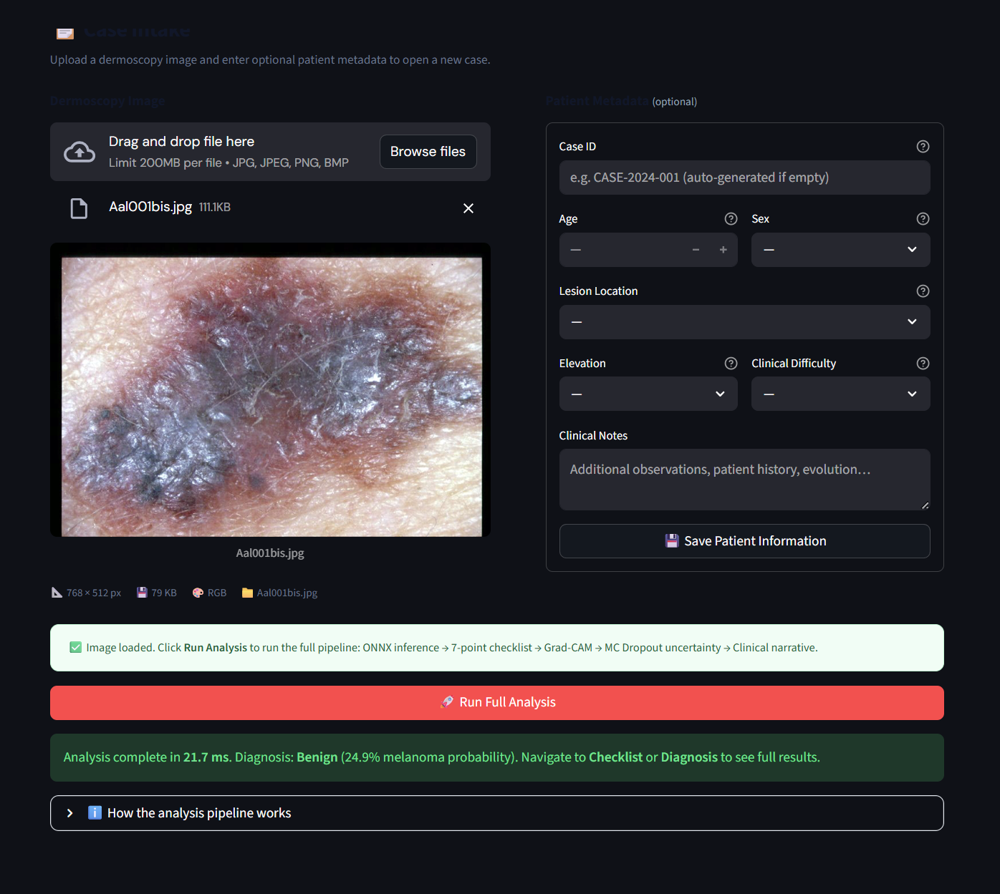
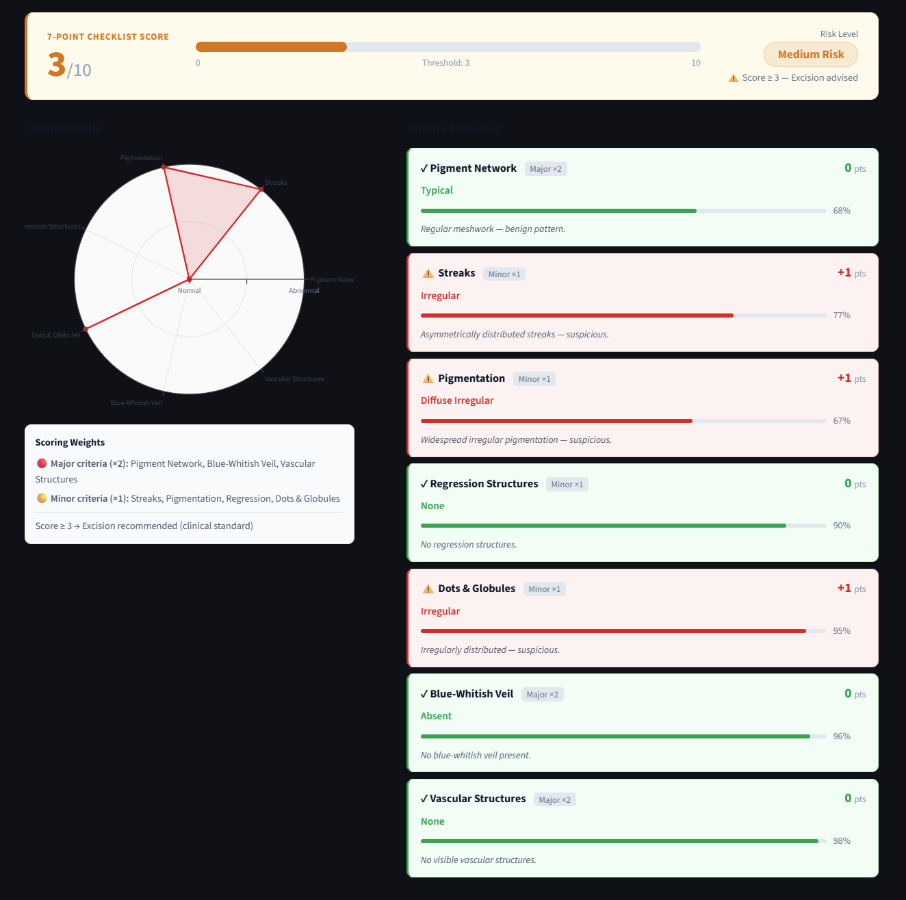
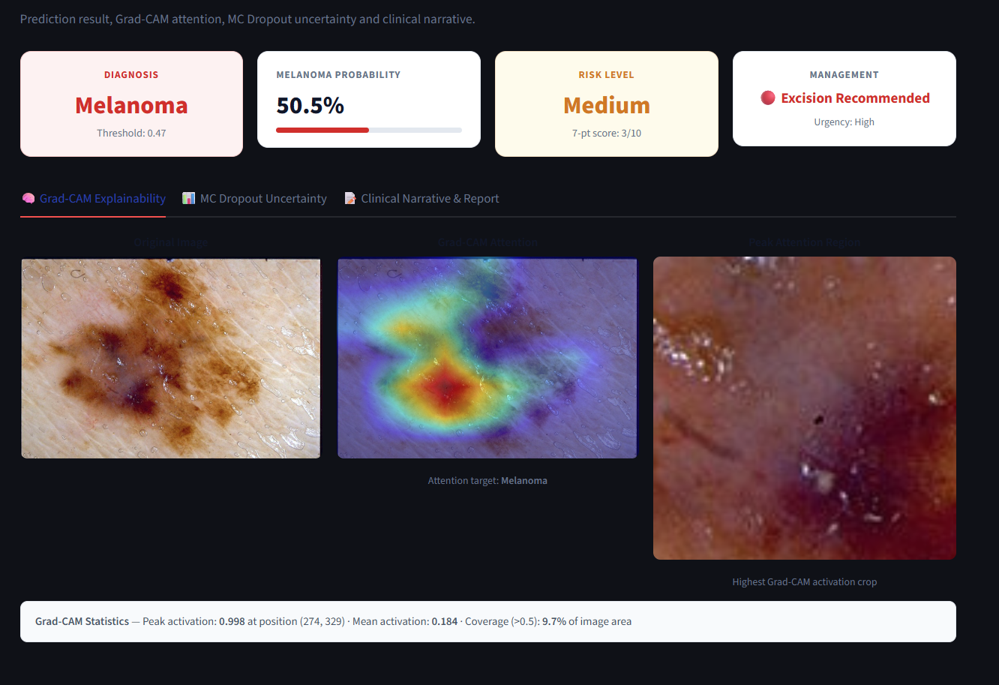
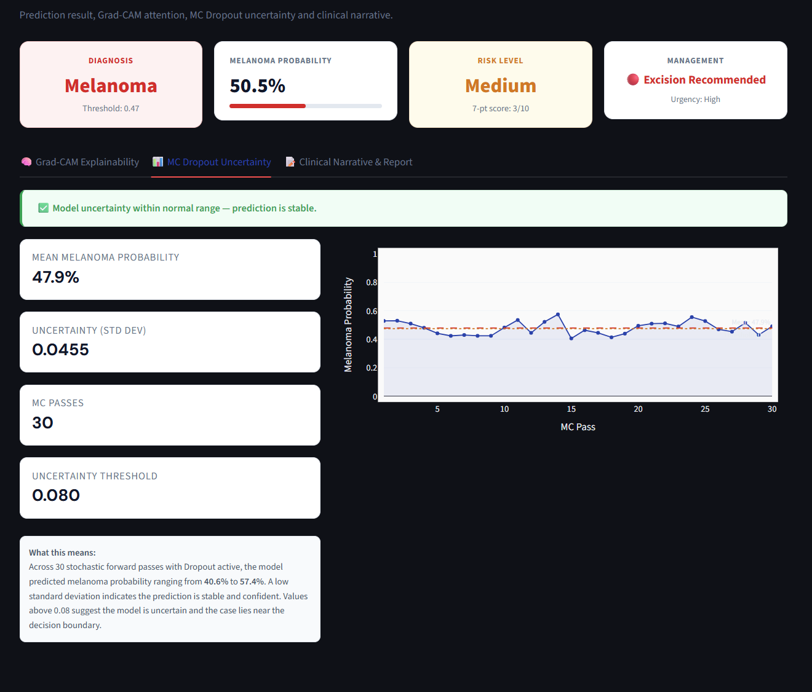
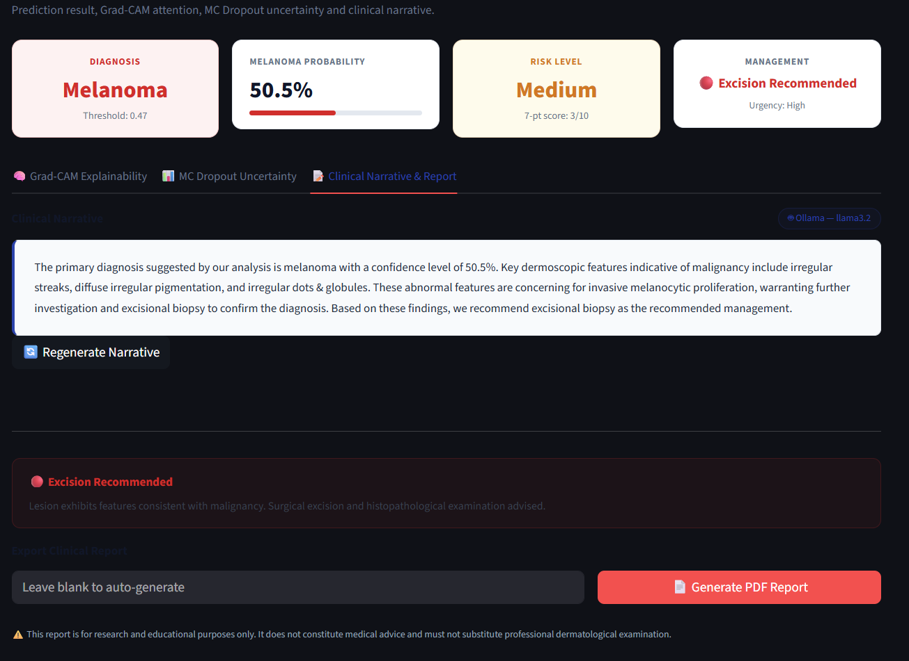
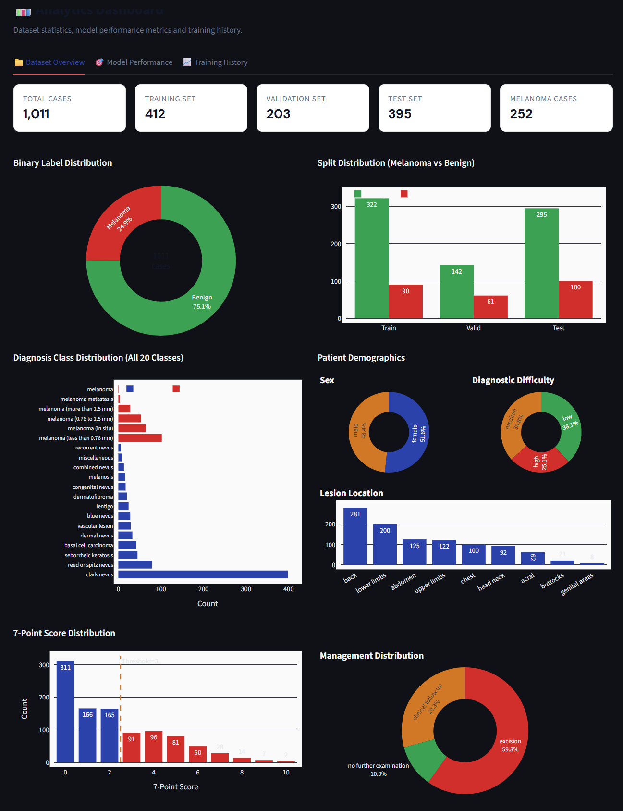
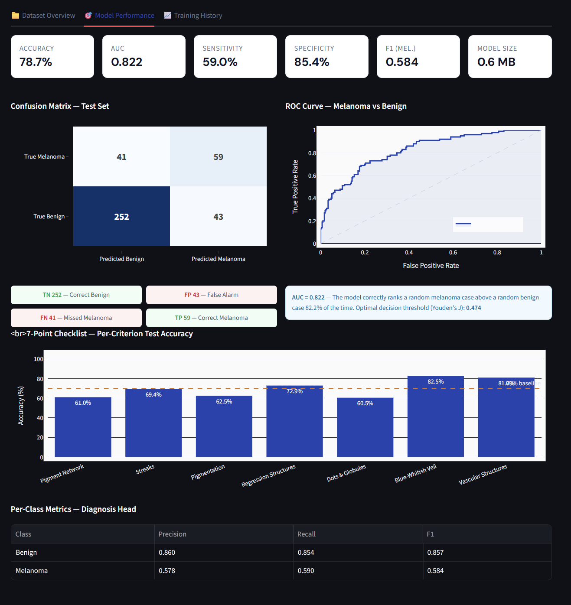

# DermVii

**AI-Assisted Dermoscopy Analysis · 7-Point Checklist · Multi-Task Deep Learning**



---

## Overview

DermVii is a clinical decision support system for dermoscopy image analysis, built on a multi-task deep learning architecture that simultaneously predicts a binary malignancy diagnosis and all seven dermoscopic criteria defined by the **7-Point Checklist** — the validated clinical scoring framework used by dermatologists to assess lesion risk.

The system is designed around a **production-realistic deployment pipeline**: trained on a cloud GPU (Google Colab T4), exported as a portable ONNX model, and served locally on CPU with no GPU dependency. Grad-CAM attention maps, Monte Carlo Dropout uncertainty quantification, and a locally-hosted LLM narrative engine complete the clinical output.

---

## Key Features

| Feature | Description |
|---|---|
| **Multi-Task Classification** | Binary diagnosis (Melanoma / Benign) + 7 checklist criteria in a single forward pass |
| **7-Point Checklist Scoring** | All criteria predicted independently with clinical weights (major ×2, minor ×1) |
| **Grad-CAM Explainability** | Gradient-weighted attention heatmap over the lesion image |
| **MC Dropout Uncertainty** | 30 stochastic passes quantify epistemic uncertainty per prediction |
| **Local LLM Narrative** | Ollama (llama3.2) generates structured clinical summaries — no external API |
| **ONNX Runtime Inference** | Sub-10ms CPU inference · 0.6 MB model · no GPU required |
| **PDF Clinical Report** | Full structured report with findings, heatmap, and narrative |
| **Live Benchmarking** | Latency histogram, P95/P99, throughput — all measured on your hardware |

---

## Architecture

```
Training (Google Colab T4)          Deployment (Local CPU)
─────────────────────────           ──────────────────────────────
Derm7pt Dataset (1,010 cases)  →   ONNX Runtime Inference Engine
  ↓                                  ↓
EfficientNet-B0 Backbone         8 Output Heads
  ↓                                  ↓
8 Multi-Task Heads              Grad-CAM (PyTorch, lazy load)
  ├─ Diagnosis Head (×2 weight)       ↓
  ├─ Pigment Network             MC Dropout (30 passes)
  ├─ Streaks                          ↓
  ├─ Pigmentation                Ollama llama3.2 Narrative
  ├─ Regression Structures            ↓
  ├─ Dots & Globules             Streamlit UI (5 pages)
  ├─ Blue-Whitish Veil                ↓
  └─ Vascular Structures         PDF Report Export
  ↓
torch.onnx.export() → molevision.onnx (0.6 MB)
```

### Model

- **Backbone:** EfficientNet-B0 (ImageNet pretrained, 5.3M parameters)
- **Heads:** 8 independent MLPs — `Linear(1280→256) → ReLU → Dropout(p=0.4) → Linear(256→N)`
- **Loss:** `2.0 × FocalLoss(diagnosis) + Σ CrossEntropy(criteria)`
- **Training:** Two-phase — Phase A: frozen backbone (10 epochs) · Phase B: top 3 blocks unfrozen (20 epochs)
- **Imbalance handling:** WeightedRandomSampler + Focal Loss (α=0.75, γ=2.0)

---

## The 7-Point Checklist

The 7-Point Checklist is a validated dermoscopic scoring system. DermVii predicts each criterion independently and computes a weighted total score. A score ≥ 3 indicates clinical suspicion of malignancy.

| Criterion | Weight | Classes |
|---|---|---|
| Pigment Network | Major (×2) | Absent · Typical · Atypical |
| Blue-Whitish Veil | Major (×2) | Absent · Present |
| Vascular Structures | Major (×2) | Absent · Arborizing · Comma · Dotted · Hairpin · Linear Irregular · Within Regression · Wreath |
| Streaks | Minor (×1) | Absent · Regular · Irregular |
| Pigmentation | Minor (×1) | Absent · Diffuse Regular · Localized Regular · Diffuse Irregular · Localized Irregular |
| Regression Structures | Minor (×1) | Absent · Blue Areas · White Areas · Combinations |
| Dots & Globules | Minor (×1) | Absent · Regular · Irregular |

---

## Application Pages

### Lesion Analysis — Case Intake

Upload a dermoscopy image and enter optional patient metadata (age, sex, lesion location, elevation). The **Run Full Analysis** button triggers the complete inference pipeline in a single pass.


---

### 7-Point Checklist Scorecard

Each criterion is displayed as a structured scorecard row with predicted category, confidence bar, clinical weight, score contribution, and a one-line clinical description. A radar chart visualises the full criteria profile.



---

### Diagnosis & Explainability — Grad-CAM

Grad-CAM attention maps highlight which image regions drove the model's prediction. The peak-activation region is cropped and displayed separately. Target class is the predicted diagnosis.



---

### MC Dropout Uncertainty

30 stochastic forward passes with Dropout active. Mean probability and standard deviation are computed across passes. Cases with std > 0.08 are flagged for expert review — the clinical narrative is suppressed and a referral warning is shown instead.



---

### Clinical Report

Structured clinical narrative generated by local **llama3.2** via Ollama, anchored in the model's structured outputs — not free-form image description. Falls back to a deterministic rule-based template if Ollama is unavailable. Full PDF export available.



---

### Analytics Dashboard — Dataset Overview

Dataset statistics including class distribution, split breakdown, 20-class diagnosis distribution, patient demographics, 7-point score histogram, and management recommendation breakdown.



---

### Analytics Dashboard — Model Performance

Confusion matrix, ROC curve (AUC = 0.822), per-criterion accuracy bar chart, and per-class precision/recall/F1 table for the diagnosis head.



---

### Training History

Loss curves, diagnosis accuracy, criteria loss, and per-criterion validation accuracy across all 30 training epochs with the Phase A→B transition marker.


---

## Results

| Metric | Value |
|---|---|
| Test Accuracy | 78.7% |
| AUC | 0.822 |
| Sensitivity (Melanoma Recall) | 59.0% |
| Specificity (Benign Recall) | 85.4% |
| F1 Score (Melanoma) | 0.69 |
| ONNX Model Size | 0.6 MB |
| Mean Inference Latency | < 10 ms (CPU) |
| MC Dropout Passes | 30 |
| Training Set | 412 cases |
| Validation Set | 203 cases |
| Test Set | 395 cases |

---

## Project Structure

```
DermVii/
  app.py                        ← Streamlit entry point
  requirements.txt
  pages/
    1_Case_Intake.py            ← Image upload + patient metadata
    2_Checklist.py              ← 7-point scorecard + radar chart
    3_Diagnosis.py              ← Grad-CAM + uncertainty + narrative + PDF
    4_Analytics.py              ← Dataset stats + model performance + training curves
    5_Benchmarks.py             ← Live latency benchmark + architecture summary
  core/
    inference.py                ← ONNX Runtime engine (all 8 heads)
    gradcam.py                  ← PyTorch Grad-CAM + MC Dropout
    narrative.py                ← Ollama client + rule-based fallback
    pdf_export.py               ← fpdf2 clinical PDF report
    utils.py                    ← Styles, session state, caching helpers
  export/
    molevision.onnx             ← ONNX model (place here after training)
    molevision_gradcam.pth      ← PyTorch weights for Grad-CAM
    metrics.json                ← Training metrics + model config
  data/
    meta.csv
    train_indexes.csv
    valid_indexes.csv
    test_indexes.csv
  screenshots/
    Lesion analysis.png
    7point Score.png
    Explanations.png
    MC Dropout.png
    Clinical Report.png
    Analytics-1.png
    Model performance.png
    Training History.png
```

---

## Setup

### 1. Install Dependencies

```bash
pip install -r requirements.txt
```

### 2. Place Export Files

After running the Colab training notebook, extract `molevision_export.zip` into the `export/` folder:

```
export/
  molevision.onnx
  molevision_gradcam.pth
  metrics.json
```

### 3. (Optional) Set Up Ollama for LLM Narratives

```bash
# Install Ollama from https://ollama.com/download
ollama serve
ollama pull llama3.2
```

The app detects Ollama automatically. If unavailable, it falls back to rule-based narrative generation without any errors.

### 4. Run

```bash
streamlit run app.py
```

---

## Training (Google Colab)

Open `MoleVision_Training.ipynb` in Google Colab with a T4 GPU runtime. Upload your Derm7pt dataset to Google Drive and update `DRIVE_DATA_ROOT` in Section 1.

```
MyDrive/
  molevision_data/
    images/          ← contains subfolders e.g. NEL/, MEL/
    meta.csv
    train_indexes.csv
    valid_indexes.csv
    test_indexes.csv
```

Expected training time: **~2–2.5 hours** on a free T4 GPU. The notebook exports `molevision_export.zip` to Drive and triggers a browser download automatically.

---

## Hardware Requirements

| Component | Minimum | Tested On |
|---|---|---|
| CPU | 4 cores, 2.5 GHz | Intel Core Ultra 7 |
| RAM | 8 GB (16 GB for Ollama) | 32 GB |
| GPU | Not required | Intel Arc 140V (unused) |
| Storage | 2 GB | 3 GB with Ollama model |
| OS | Windows / Linux / macOS | Windows 11 |

---

## Technical Stack

| Layer | Technology |
|---|---|
| Training | PyTorch · timm · EfficientNet-B0 |
| Export | torch.onnx · ONNX opset 18 |
| Inference | ONNX Runtime (CPUExecutionProvider) |
| Explainability | Grad-CAM (PyTorch hooks) · MC Dropout |
| LLM | Ollama · llama3.2 · REST API |
| UI | Streamlit · Plotly |
| PDF | fpdf2 |
| Dataset | Derm7pt (1,010 cases · dual imaging) |

---

## Dataset

**Derm7pt** — a dermoscopy dataset of 1,010 cases, each containing a clinical photograph and a dermoscopy image. Every case is annotated with:

- A final diagnosis across 20 classes (grouped into Melanoma / Benign for training)
- Independent labels for all 7 checklist criteria
- Patient metadata: sex, lesion location, elevation, diagnostic difficulty
- Management outcome: excision, clinical follow-up, or no further examination

---

## Disclaimer

DermVii is a research and educational portfolio project demonstrating multi-task deep learning, clinical AI explainability, and production-oriented model deployment. It is not a certified medical device. All outputs must be reviewed by a qualified dermatologist before any clinical action is taken.

---

*Built with PyTorch · ONNX Runtime · Streamlit · Ollama*
